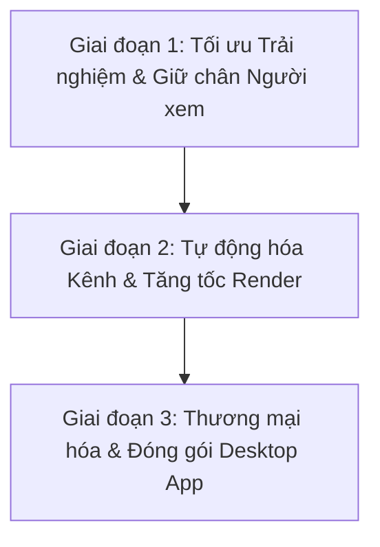

# BÁO CÁO ĐỊNH HƯỚNG PHÁT TRIỂN CHIẾN LƯỢC DÀI HẠN
## HỆ THỐNG TẠO VIDEO AI TỰ ĐỘNG (AI-VIDEO-MAKER)
**Mã văn bản:** `AI_VIDEO_MAKER_BaoCao_DinhHuong_v1_20260730`  
**Ngày ban hành:** 30/07/2026  
**Phiên bản:** v1  

---

## 1. Bối cảnh & Hiện trạng Kỹ thuật Hệ thống

### 1.1 Tổng quan Kiến trúc
Hệ thống **AI-VIDEO-MAKER** xây dựng trên mô hình vi dịch vụ (Micro-services). Phần backend phát triển bằng FastAPI (Python) với hơn 2,500 dòng code xử lý lõi tại `main.py` và hơn 20 dịch vụ chuyên biệt (`services/`). Giao diện frontend xây dựng bằng React, Vite, Tailwind CSS và Store.js.

Bộ kiểm thử tự động (Unit test) đạt 132 bài test pass 100%. Bộ test bao phủ các module trộn âm thanh (Audio Mix), render khung hình, hiệu ứng chữ (Hook Text) và hợp đồng dữ liệu frontend. Dung lượng lưu trữ toàn thư mục dự án hiện đạt 2.23 GB. Hệ thống duy trì trạng thái lưu trữ gọn gàng và không tích tụ file rác render.

### 1.2 Đánh giá 5 Chế độ Tạo Video Core
1. **Storyteller Mode:** Tự động sinh kịch bản từ chủ đề, tạo ảnh AI bằng Imagen, lồng tiếng TTS (Text-To-Speech) và ghép nhạc nền BGM (Background Music).
2. **Photo Narration Mode:** Tiếp nhận ảnh từ người dùng. Gemini Multimodal phân tích ngữ cảnh hình ảnh để tạo lời thoại và lồng tiếng.
3. **Photo Slideshow Mode:** Tạo video trình chiếu ảnh điện ảnh (Cinematic Slideshow) kết hợp nhạc nền.
4. **Script Video Mode:** Tiếp nhận kịch bản thô từ người dùng. Gemini tự động chia phân cảnh và tạo hình ảnh minh họa.
5. **Quiz Listicle Mode:** Sinh video dạng Top N (Sự thật thú vị, mẹo hay) hoặc câu hỏi trắc nghiệm Q&A tăng tương tác.

---

## 2. Phân tích Phản chiếu Đối thủ & Định vị Thị trường

Dưới đây là bảng so sánh đối chiếu kỹ thuật giữa **AI-VIDEO-MAKER** và 4 nền tảng dẫn đầu thị trường năm 2026 (InVideo AI, Submagic, AutoShorts.ai, CapCut):

| Tiêu chí Kỹ thuật | AI-VIDEO-MAKER | InVideo AI | Submagic | AutoShorts.ai | CapCut AI |
| :--- | :---: | :---: | :---: | :---: | :---: |
| **Đa dạng Chế độ Video** | **5 Chế độ** | 1 Prompt chung | Không có | 1 Dạng Faceless | 2 Dạng |
| **Phụ đề Nảy Từng Từ (Kinetic)** | Căn bản (Dòng) | Trung bình | **Rất mạnh (Word-level)** | Căn bản | Mạnh |
| **Xử lý Âm thanh & SFX** | **Beat-sync & Cooldown** | Trung bình | Tự chèn SFX | Thô | Tự động |
| **Tự động Cắt Lặng (Auto-Trim)** | Chưa có | Không có | Có sẵn | Không có | **Rất mạnh** |
| **Tự động Đăng bài (Auto-Post)** | Chưa có | Không có | Không có | **Tự động 100%** | Không có |
| **Chỉnh sửa bằng Chat AI** | Chưa có | **Có sẵn** | Không có | Không có | Không có |
| **Chi phí Vận hành Engine** | **~0 VNĐ (Local)** | Rất đắt ($60/tháng) | Đắt ($50/tháng) | Đắt ($99/tháng) | Miễn phí/Pro |

### 4 Điểm Đột phá Cần Học hỏi từ Đối thủ:
1. **Submagic:** Phụ đề chuyển động nảy theo từng từ (Word-by-word Kinetic Captions) và tự động đổi màu keyword.
2. **CapCut:** Loại bỏ khoảng im lặng (Auto-Trim Silence) kéo dài $>0.3s$ để tạo nhịp dồn dập.
3. **InVideo AI:** Biên tập video bằng lệnh thoại tự nhiên (Chat-to-Edit AI) và chỉ render lại phân cảnh thay đổi.
4. **AutoShorts.ai:** Đặt lịch tự động tạo video và đăng bài trực tiếp lên TikTok/YouTube Shorts via API.

---

## 3. Lộ trình Phát triển Chiến lược 3 Giai đoạn

### 3.1 Giai đoạn 1: Tối ưu Trải nghiệm & Giữ chân Người xem (Ngắn hạn: 1 - 2 tuần)

#### Mục tiêu:
Giải quyết dứt điểm các tồn đọng kỹ thuật nhỏ và nâng cao chỉ số giữ chân người xem (Viewer Retention Rate) cho video.

#### Tác vụ Chi tiết:
1. **Xử lý 2 tồn đọng kỹ thuật hiện tại:**
   * Đấu nối trường dữ liệu `cta_text` từ Gemini. Đảm bảo phân cảnh Outro hiển thị câu kêu gọi hành động thay vì dùng nhầm `hook_text`.
   * Khắc phục bậc nhảy độ sáng $67 \rightarrow 34.6$ trong $0.15s$ đầu tiên của phân cảnh Hook.
2. **Phát triển Module Phụ đề Động `subtitle_kinetic_engine.py`:**
   * Khai thác dữ liệu thời gian chi tiết từng từ (Word-level timestamps) từ dịch vụ TTS/Whisper.
   * Xuất file phụ đề `.ass` hỗ trợ hiệu ứng phình to từ (Bounce effect) và đổi màu từ đang đọc.
   * Tự động trộn tiếng *Pop / Whoosh* vào đúng vị trí từ khóa chính.
3. **Phát triển Module Cắt Lặng `silence_remover.py`:**
   * Dùng bộ lọc `silencedetect` của FFmpeg để phát hiện các khoảng im lặng $>0.3s$ trong đoạn đọc giọng nói.
   * Cắt bỏ khoảng lặng thừa, duy trì khoảng nghỉ $0.1s$ mượt mà giữa các câu nhằm tạo nhịp video dồn dập.

---

### 3.2 Giai đoạn 2: Tự động hóa Kênh & Tăng tốc Render (Trung hạn: 1 - 3 tháng)

#### Mục tiêu:
Biến hệ thống thành cỗ máy tự động tạo nội dung và tối ưu hóa hiệu suất render phần cứng.

#### Tác vụ Chi tiết:
1. **Tăng tốc Render Phần cứng (Hardware Acceleration):**
   * Cấu hình FFmpeg tích hợp bộ mã hóa phần cứng Nvidia NVENC (h264_nvenc / hevc_nvenc) hoặc Intel QSV.
   * Giảm thời gian render video độ phân giải 1080p từ 45 giây xuống dưới 10 giây.
2. **Xây dựng Module Lên lịch & Tự động Đăng bài `series_scheduler.py`:**
   * Sử dụng `APScheduler` chạy ngầm tại Backend. Cho phép người dùng thiết lập các chuỗi video tự động theo chủ đề.
   * Tích hợp API xuất bản nội dung của TikTok (Content Posting API) và YouTube (YouTube Data API v3).
   * Sử dụng bộ xoay vòng API Key (`key_manager.py`) để duy trì tiến trình render và đăng bài ngầm mà không bị nghẽn ngạch.
3. **Hoàn thiện Giao diện Xem trước Thực (Realtime Preview UI):**
   * Cho phép xem trước kịch bản, khung hình và âm thanh ngay trên giao diện React trước khi bấm xuất bản chính thức.

---

### 3.3 Giai đoạn 3: Thương mại hóa & Đóng gói Phần mềm (Dài hạn: 3 - 6 tháng)

#### Mục tiêu:
Chuyển đổi dự án từ ứng dụng Localhost thành phần mềm thương mại hoàn chỉnh bán ra thị trường.

#### Tác vụ Chi tiết:
1. **Đóng gói Phần mềm Desktop (`.exe` / `.dmg`):**
   * Sử dụng khung phát triển **Tauri** hoặc **Electron.js** để đóng gói toàn bộ Backend Python, FFmpeg và Frontend React thành một file cài đặt phần mềm duy nhất.
   * Người dùng cài đặt và chạy trực tiếp trên máy tính cá nhân mà không cần thao tác dòng lệnh Terminal.
2. **Phát triển Tính năng Biên tập bằng Hỏi đáp AI (Chat-to-Edit):**
   * Xây dựng Endpoint `POST /api/project/chat-edit`.
   * Cho phép người dùng gõ câu lệnh tùy chỉnh video. Gemini phân tích và cập nhật kịch bản JSON.
   * Tích hợp cơ chế Render lại cục bộ (Incremental Re-render) để chỉ xuất lại phân cảnh bị thay đổi.
3. **Tích hợp Hệ thống Quản lý Bản quyền (License Key Management):**
   * Xây dựng cơ chế xác thực License Key trực tuyến. Khóa tính năng hoặc giới hạn số lượng render đối với người dùng chưa đăng ký bản quyền.

---

## 4. Quy chuẩn Quản lý Dữ liệu & An toàn Kỹ thuật

### 4.1 Quy tắc Đặt tên File & Lưu trữ Version
* Mọi file báo cáo, sơ đồ và tài liệu kỹ thuật tuân thủ định dạng đặt tên:  
  `[MãDA]_[LoạiVB]_[GiaiDoan]_v[N]_[YYYYMMDD].[đuôi file]`
* Ví dụ: `AI_VIDEO_MAKER_BaoCao_DinhHuong_v1_20260730.md`

### 4.2 Tự động hóa Dọn dẹp File Tạm
* Phát triển script `clean_cache.py` chạy định kỳ.
* Tự động xóa các file video tạm trong `backend/test_workspace` và các file upload cũ quá 7 ngày để duy trì dung lượng bộ nhớ toàn hệ thống dưới ngưỡng 3.0 GB.

---
**NGƯỜI LẬP BÁO CÁO**  
*AI System Architect — Antigravity Engineering Team*
