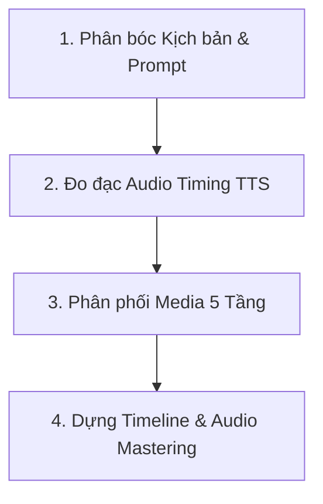

# Báo Cáo Kỹ Thuật: Kiến Trúc Hệ Thống & Luồng Đồng Bộ Media Với Content Trong AI-VIDEO-MAKER

**Mã tài liệu:** AI_VIDEO_MAKER_BaoCao_DongBoMedia_v1_20260801  
**Ngày phát hành:** 01/08/2026  
**Phiên bản:** v1.0  
**Tác giả:** AI Systems Engineer  

---

## 1. Tổng Quan Hệ Thống (System Overview)

**AI-VIDEO-MAKER** là hệ thống phần mềm dạng **Client-Server (Single Page Application)** chuyên dụng để tự động hóa toàn bộ quy trình sản xuất video ngắn (TikTok, YouTube Shorts, Facebook Reels) bằng các mô hình Trí tuệ Nhân tạo tiên tiến nhất hiện nay.

### 1.1. Sơ đồ Kiến trúc Thư mục & Mã nguồn (Directory Structure)

```text
C:\dev\AI-VIDEO-MAKER\
├── USER_GUIDE.md                 # Hướng dẫn vận hành cho người dùng & AI Skill
├── PROJECT_STRUCTURE.md          # Giải trình cấu trúc tổng thể hệ thống v2.3+
├── ROADMAP.md                    # Lịch trình nâng cấp & tính năng tương lai
├── ARCHITECTURE.md               # Kiến trúc dữ liệu Async Pipeline chuyên sâu
├── frontend/                     # Web UI Application (React + Vite + Tailwind CSS)
│   ├── src/App.jsx               # Logic giao diện SPA, state điều khiển & API polling
│   ├── src/store.js                  # Quản lý state tập trung (Centralized State)
│   ├── src/index.css             # Định dạng giao diện (Micro-animations, Dark mode, Glow)
│   └── vite.config.js            # Cấu hình build Vite
├── backend/                      # API Server (FastAPI - Python)
│   ├── main.py                   # Entry point khởi chạy FastAPI Server & Async Job Routing
│   ├── config.py                 # Nguồn sự thật quản lý đường dẫn (BUNDLED vs DATA assets)
│   ├── .env                      # Lưu biến môi trường (API Keys, CUSTOM_ASSETS_DIR)
│   ├── services/                 # Bộ 21 Services xử lý logic nghiệp vụ chính:
│   │   ├── gemini_service.py     # Prompt LLM, chia cảnh & Pydantic Structured Outputs
│   │   ├── veo_service.py        # Dịch vụ sinh Video AI mượt mà bằng Google Veo 3.1
│   │   ├── image_router.py       # Bộ điều phối phân luồng lấy media 5 tầng (Veo/Imagen/Pollinations/Pexels/Pixabay)
│   │   ├── image_upload_service.py # Xử lý tài nguyên người dùng tải lên
│   │   ├── tts_service.py        # Thuyết minh OmniVoice v3.2 (GPU Zero-shot) & Edge-TTS (Fallback 4 lớp)
│   │   ├── video_service.py      # Dựng khung video cơ bản qua MoviePy Engine
│   │   ├── ffmpeg_assembler.py   # Render mượt tăng tốc phần cứng NVENC qua 1 lệnh FFmpeg
│   │   ├── audio_mix_service.py  # Audio Mastering: Ducking BGM, Loudnorm, Subtitle ASS Burn-in
│   │   ├── render_worker.py      # Worker chạy trong process độc lập (Multiprocessing)
│   │   ├── hook_engine.py        # 4 hiệu ứng mở màn (Slot Machine, Blackout, Typewriter, Vignette)
│   │   ├── beat_sync.py          # Phân tích peak âm thanh đồng bộ nhịp chuyển cảnh
│   │   ├── motion_effects.py     # Source of Truth cho Ken Burns, Zoom, Pan, Transitions
│   │   ├── cache_service.py      # Cache v2 lưu kịch bản & media nhị phân theo hash prompt
│   │   ├── preset_service.py     # Quản lý & tự động merge Presets người dùng
│   │   ├── project_service.py    # Smart Resume Checkpoints (Lưu vết tiến độ job)
│   │   ├── quota_service.py      # Bộ đếm Quota & giới hạn API gọi trong ngày
│   │   ├── key_manager.py        # Quản lý xoay vòng tự động API Keys
│   │   └── log_setup.py          # Log xoay vòng UTF-8 gắn [job_id]
│   └── assets/                   # Lưu trữ tài nguyên gốc và thành phẩm
│       ├── bgm/, sfx/, fonts/    # Tài nguyên gốc cố định (BUNDLED)
│       └── audio/, images/, output/, cache/ # Tài nguyên sinh ra động (DATA)
└── docs/                         # Tài liệu kỹ thuật & SOP hệ thống
```

---

## 2. Quy Trình Đồng Bộ Ảnh/Video Với Content (Media-Content Synchronization)

Hệ thống vận hành theo luồng **Async Pipeline 4 bước** để đảm bảo hình ảnh/video hiển thị chính xác theo từng câu thuyết minh và khớp khung thời gian milli-giây.



### 2.1. Bước 1: Phân bóc Kịch bản & Sinh `image_prompt` (Gemini LLM)
Trong `services/gemini_service.py`, Gemini LLM nhận prompt chủ đề và sinh kịch bản dưới dạng cấu trúc dữ liệu nghiêm ngặt `LLMScriptResponse` chứa danh sách các phân cảnh `Scene`:
- `text`: Lời thoại đọc voice-over (ngôn ngữ nói tự nhiên, không chứa ký tự đặc biệt).
- `image_prompt`: Mô tả chi tiết bối cảnh bằng tiếng Anh phục vụ AI sinh ảnh (bao gồm các từ khóa điện ảnh như *8k, photorealistic, cinematic lighting, depth of field*).
- `visual_source`: Định hướng nguồn media (`auto`, `ai_image`, `ai_video`, `stock_video`, `user_upload`).
- `highlight_text`: Từ khóa đắt giá (1-3 từ, viết HOA) xuất hiện nguyên văn trong `text` để làm hiệu ứng chữ nổi bật đúng giây phát âm.

### 2.2. Bước 2: Đo đạc & Đồng bộ Thời lượng Âm thanh (Audio Timing Sync)
1. Trong `services/tts_service.py`, văn bản `text` của từng cảnh được tổng hợp thành file âm thanh thuyết minh `.wav` bằng engine **OmniVoice v3.2** trên GPU (hoặc **Edge-TTS** dự phòng).
2. Thời lượng phát âm thanh thực tế (`audio_duration`) được đo đạc chính xác tới từng mili-giây.
3. Trong `services/scene_balancer.py`, nếu câu thoại dài (> 10-12s), hệ thống tự động tách cảnh hoặc điều chỉnh `image_prompt` để đảm bảo nhịp chuyển cảnh mượt mà, không bị khựng hình.

### 2.3. Bước 3: Bộ Điều Phối & Phân Phối Media 5 Tầng (Multi-Layer Fallback Router)
Trong `services/image_router.py` và `services/veo_service.py`, hệ thống xử lý tìm kiếm / sinh media cho từng phân cảnh theo thứ tự ưu tiên 5 tầng:

- **Tầng 0 (User Asset / Override)**: Nếu người dùng tải lên ảnh/video thủ công (`override_asset`), ưu tiên sử dụng 100%.
- **Tầng 1 (AI Video - Google Veo 3.1)**: Khi yêu cầu `ai_video`, gọi Veo 3.1 sinh clip 24fps điện ảnh. Sử dụng *Character Reference Images* để giữ hình dáng nhân vật nhất quán xuyên suốt các cảnh (tránh hiện tượng *identity drift*).
- **Tầng 2 (AI Image - Gemini 3.1 Flash / Imagen 3)**: Sinh ảnh tĩnh 8K photorealistic theo `image_prompt`.
- **Tầng 3 (AI Image Fallback - Pollinations FLUX)**: Khi Google Gemini gặp sự cố Quota (HTTP 429/503), router tự động chuyển sang Pollinations FLUX (miễn phí, không quota) để sinh ảnh AI sắc nét mà không ngắt luồng pipeline.
- **Tầng 4 (Stock Video/Photo - Pexels HD & Pixabay)**: Trích xuất từ khóa chuẩn qua `stock_query_from_prompt()`, lọc clip liên quan và chấm điểm ứng viên để lấy footage thực tế chất lượng cao.
- **Tầng 5 (Offline Gradient)**: Sinh ảnh gradient nghệ thuật điện ảnh nếu mất mạng hoàn toàn.

### 2.4. Bước 4: Dựng Timeline & Khớp Hiệu ứng Chuyển động
Trong `services/motion_effects.py` và `services/ffmpeg_assembler.py`:
- **Ảnh tĩnh (AI Image)**: Áp dụng hiệu ứng camera động **Ken Burns** (Slow Zoom In, Dynamic Zoom Out, Pan Left/Right) kéo dài **chính xác 100% thời lượng `audio_duration`**.
- **Video Stock ngắn hơn voice**: Áp dụng kỹ thuật lặp (loop / ping-pong) hoặc giãn tốc độ mượt mà.
- **Phụ đề Karaoke (Word-level ASS Subtitles)**: Tạo phụ đề nhấp nháy khớp theo chính xác từng từ khi voice đọc.
- **Audio Mastering**: Tự động giảm âm lượng BGM (*Sidechain ducking*) xuống 15-20% khi lời đọc phát lên và tự động tăng lại nhạc nền khi nghỉ giữa các cảnh.

---

## 3. Hồ Sơ Kỹ Thuật Chi Tiết Tầng 4 (Stock Curator)

Tầng 4 chịu trách nhiệm tìm kiếm, đánh giá và tải xuống tài nguyên video/hình ảnh thực tế từ các kho lưu trữ Pexels và Pixabay.

### 3.1. Các Nhà Cung Cấp & Điểm Neo API

| Nhà Cung Cấp | API Endpoint | Phương Thức | Tham Số Chuẩn |
| :--- | :--- | :--- | :--- |
| **Pexels Photo** | `https://api.pexels.com/v1/search` | `GET` | `query`, `per_page=1`, `orientation` |
| **Pexels Video** | `https://api.pexels.com/videos/search` | `GET` | `query`, `per_page=15`, `orientation` |
| **Pixabay Video**| `https://pixabay.com/api/videos/` | `GET` | `key`, `q`, `per_page=20`, `video_type=film` |

*Lưu ý:* Pexels API bắt buộc gửi kèm header `User-Agent: Chrome/120.0.0.0` để tránh lỗi HTTP 403 Forbidden.

### 3.2. Tiền Xử Lý Từ Khóa Tìm Kiếm (`stock_query_from_prompt`)
Chuyển hóa `image_prompt` dài của Gemini thành câu truy vấn rút gọn chứa các danh từ chính (chủ thể) nhằm loại bỏ các từ khóa đồ họa rác.

### 3.3. Thuật Toán Kiểm Tra Độ Liên Quan & Chống Match Mờ (`_pool_is_relevant`)
Các kho stock thường trả về kết quả match mờ (fuzzy search) ngay cả khi không có clip khớp. Hàm `_pool_is_relevant()` thực hiện:
1. Trích xuất danh sách từ khóa chính từ query (`_stem` rút gọn đuôi số nhiều).
2. Đối chiếu từ khóa với URL Slug hoặc Tags mô tả của toàn bộ ứng viên trong pool.
3. Nếu **100% ứng viên trong pool** không chứa bất kỳ từ khóa nào $\rightarrow$ Ném ngoại lệ `StockIrrelevantError` để hệ thống tự động hạ bậc / đổi nguồn mà không lấy nhầm clip rác.

### 3.4. Thuật Toán Chấm Điểm Ứng Viên Clip (`_score_stock_candidate`)
Mỗi ứng viên video được chấm một điểm phạt (Penalty Score) — điểm **càng THẤP càng được ưu tiên chọn**:

$$\text{Score} = \text{ratio\_penalty} + \text{dur\_penalty} + \text{res\_penalty}$$

Trong đó:
- $\text{ratio\_penalty} = \left| \text{target\_ratio} - \frac{\text{width}}{\text{height}} \right| \times 3.0$: Phạt nặng nếu lệch tỉ lệ khung hình (`9:16`, `16:9`, `1:1`).
- $\text{dur\_penalty} = \frac{\text{needed\_dur} - \text{src\_dur}}{\text{needed\_dur}} \times 0.8$: Phạt nếu clip ngắn hơn thời lượng âm thanh cần thiết.
- $\text{res\_penalty} = \frac{\text{target\_h} - \text{best\_h}}{\text{target\_h}} \times 1.2$: Phạt nếu độ phân giải thấp hơn khung hình đích.

### 3.5. Cơ Chế Chống Trùng Lặp Clip (`used_ids`)
1. Duy trì tập hợp `used_ids` trong suốt luồng render của một job.
2. Lọc danh sách ứng viên mới chưa từng sử dụng (`fresh = [v for v in candidates if v['id'] not in used_ids]`).
3. Chỉ khi kho hết sạch clip mới thì mới dùng lại clip cũ.
4. Ghi lại ID vào metadata cache (`out_meta`) để duy trì chống trùng clip khi re-render job.

### 3.6. Tải Dữ Liệu Tối Ưu Bộ Nhớ (Stream Chunking)
Sử dụng `requests.get(selected['link'], stream=True)` kết hợp ghi đĩa theo từng đoạn `chunk_size = 256KB`. Kỹ thuật này giúp giải phóng bộ nhớ RAM, tránh tình trạng bị đè nén bộ nhớ khi tải song song nhiều clip HD/4K dung lượng lớn.

---

## 4. Kết Luận & Đánh Giá

Kiến trúc đồng bộ media của **AI-VIDEO-MAKER** đạt độ hoàn thiện cao nhờ:
- Luồng bất đồng bộ (Async Pipeline) phân tách rõ ràng giữa khâu xử lý nội dung (LLM), thời lượng audio (TTS) và dựng visual.
- Cơ chế dự phòng 5 tầng đa dạng đảm bảo tỉ lệ render thành công 100% ngay cả khi các dịch vụ AI bên ngoài gặp sự cố quota.
- Thuật toán lựa chọn Stock khoa học giúp chất lượng hình ảnh / video đạt tiêu chuẩn điện ảnh chuyên nghiệp.
